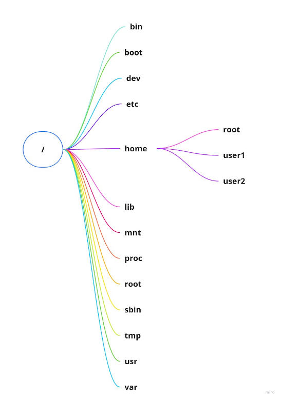

# Sistema de Arquivos Linux - FHS

  

### Visão geral do sistema de arquivos

  

  

Este artigo é baseado na hierarquia FHS a fim de definir o padrão organizado para árvore de diretórios de um sistema Linux partindo da premissa que tudo deve estar em locais padronizados.As informações descritas não são detalhadas a fundo.

  

Observação: Nenhuma organização dita uma regra organizacional do sistema de arquivos do sistema Linux, mas teve o apoio de muitas distribuições em seguir o FHS seguindo a tradição.

  

  

No decorrer deste artigo veremos muito as palavras **'estrutura organizacional'** da qual faz-se referência a **'directory tree'**.

  

A estrutura organizacional pode ter ramificações independente do disco de armazenamento e limite,facilitando a administração do sistema e até o backup, imagine um servidor com informações sensíveis e de grande escala, isso facilitará muito no tempo de operação quanto na qualidade deum serviço de backup; Projetada para operar em uma rede de máquinas, ou por meio de rede como por exemplo o NAS (Network Attached Storage) caso queira saber um pouco mais sobre, tem um artigo da [Red Hat](https://www.redhat.com/en/topics/data-storage/network-attached-storage)

  

### Os Sistemas de Arquivos

  

* **/**

  * Sistema de arquivos representado por uma barra **/** e dentro deste encontram o restante, um ponto interessante é que estes inclusos são compostos por 3 letras;

* **usr**

  * Sistema de arquivos representado por **/usr** contém bibliotecas, todos os comandos, manuais (man, help) e arquivos imutáveis necessário para operação de sistema;

  * Os arquivos não devem ser modificados e não específicos por máquina assim permitindo o seu compartilhamento sendo vantajoso na questão da atualização de uma aplicação sem a necessidade de executar máquina por máquina (Isso em casos específicos);

  * Em situações específicas o sistema de arquivos pode ser montado como somente leitura reduzindo as chances de quebra de arquivos no decorrer de uma operação falha;

* **var**

  * Sistema de arquivos representado por **/var** contém arquivos mutáveis como por exemplo logs de sistemas, aplicações e até spool(mail, print e etc)

  * Arquivos deste sistemas devem estar um nível abaixo do sistema de arquivos /usr o que impossibilita a montagem deste em somente leitura;

* **home**

  * Sistema de arquivos representado por **/home** contém os arquivos de usuários separadamente por uma ramificação extra abaixo como por exemplo **/home/usuario1 /home/usuario2** com armazenamento de arquivos pessoais e de configurações de ambientes separados e em meio a suas vantagens a facilidade de realizar um backup individual é uma dessas;

  

  

### Raiz
No geral não contém arquivos com a exceção de sistemas antigos que utiliza do sistema de arquivos **/vmlinuz** utilizado para inicialização de sistema do qual foi optado pelas novas distribuições do uso do sistema de arquivos **/boot**

  

* **bin**

  * Sistema de arquivos representado por **/bin** contém os comandos utilizados pelo usuário como por exemplo o famoso **cp, rm, ls** e sua funcionalidade é somente após a conclusão do ciclo de boot do sistema;

* **sbin**

  * Sistema de arquivos representado por **/sbin** tipo o **/bin** mas para fins administrativos como por exemplo **ifconfig, fdisk, ps**

* **etc**

  * Sistema de arquivos representado por **/etc** contém os arquivos de configurações de sistema, uma configuração de dns, backup como por exemplo o rsnapshot em **/etc/rsnapshot.conf**

* **root**
   * Sistema de arquivos representado por **/root** contém os arquivos de usuário root o qual não é acessível por outros usuários de sistema;

* **lib**

  * Sistema de arquivos representado por **/lib** contém bibliotecas de sistema e aplicações, como por exemplo os comandos existentes na estrutura organizacional **/bin e /sbin** do qual requer alguns arquivos da biblioteca para funcionar; Outras ramificações contém arquivos de biblioteca como por exemplo **/usr/lib** ou **/usr/local/lib** ou **/var/lib**

* **modules**

  * Sistema de arquivos representado por **/lib/modules** contém módulos de inicialização do kernel, arquivos de rede e do sistema de arquivos;

* **dev**

  * Sistema de arquivos representado por **/dev** contém os arquivos de dispositivos usb, hard drive e ssd, sendo estes alguns exemplos;

* **tmp**

  * Sistema de arquivos representado por **/tmp** contém os arquivos temporários de sistema e aplicações;

* **boot**

  * Sistema de arquivos representado por **/boot** contém os arquivos de carregamento de sistema (bootstrap loader) exemplo do LILO ou GRUB. Mantém as imagens de kernel aqui ao invés de mantelas na estrutura organizacional root;

* **mnt**

  * Sistema de arquivos representado por **/mnt** contém os arquivos de montagem manual temporários não recomendável para montagens automáticas para aplicações ou administração de sistema, como por exemplo um disco rígido conectado para uma ação temporária ou até um pendrive criando novas ramificações, exemplo de **/mnt/pendrive_teste**;

* **usr**

  * Sistema de arquivos representado por **/usr** contém os arquivos de todos os programas no sistema instalados, este diretório dependendo da quantidade de programas instalados sua dimensão de armazenamento pode ser imensa;

* **var**

  * Sistema de arquivos representado por **/var** contém os arquivos mutáveis e específico da máquina e sistema, ou seja, não podendo ser compartilhado com outra máquina ou sistema;

* **proc**

  * Sistema de arquivos representado por **/proc** contém os arquivos de sistemas imagináveis inexistentes em disco onde o Kernel os cria na memória RAM afim de fornecer informações sobre o sistema (nome de processos);

  

  

#### Fontes

http://www.linfo.org/

PDF - The Linux System Administrator's Guide

https://www.linuxnix.com/linux-directory-structure-lib-explained/

https://tldp.org/LDP/sag/html/dev-fs.html
